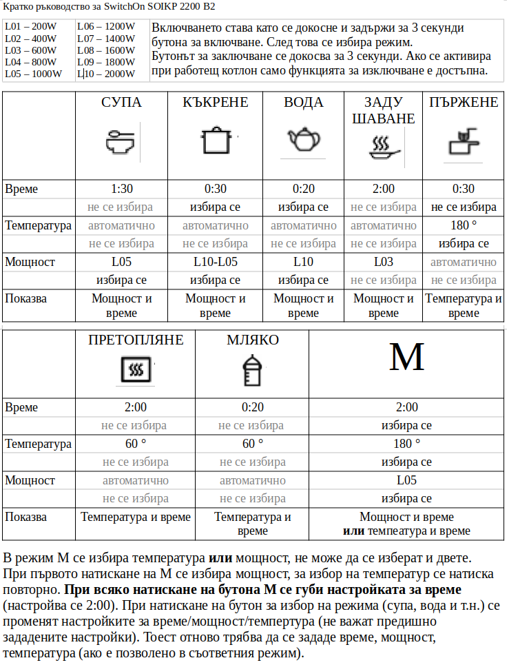

# Кратко ръководство за индукционен котлон SwitchOn SOIKP 2200 B2

Информацията в това ръководство е на база не само четене на официалното ръководство, но и тестване на самия уред.

За да науча това, което описвам в неофициалното кратко ръководство, не беше достатъчно да прочета официалното ръководство, наложи се да тествам обстойно уреда.

Функция, която за съжаление липсва, е в режим M да задам едновременно таван на температурата и таван на мощността.

Не е документирано каква температура е зададена в режими супа, къкрене, вода, задушаване.

Оригиналното ръководство може да изтеглите като потърсите с код 460026 на [страницата на Кауфланд](https://www.kaufland.bg/moyat-kaufland/uslugi/produktova-informatsiya/rykovodstva-za-upotreba.html). Качих копие от официалното ръководство и [тук](SOIKP_2200_B2_4ca918cb-886a-4727-b7e1-ecba8979d025.pdf).

Изтеглете версията в [PDF](SOIKP_2200_B2.pdf) или [ODT](SOIKP_2200_B2.odt) за печат.

Изображение с малка разделителна способност за предварителен преглед:

